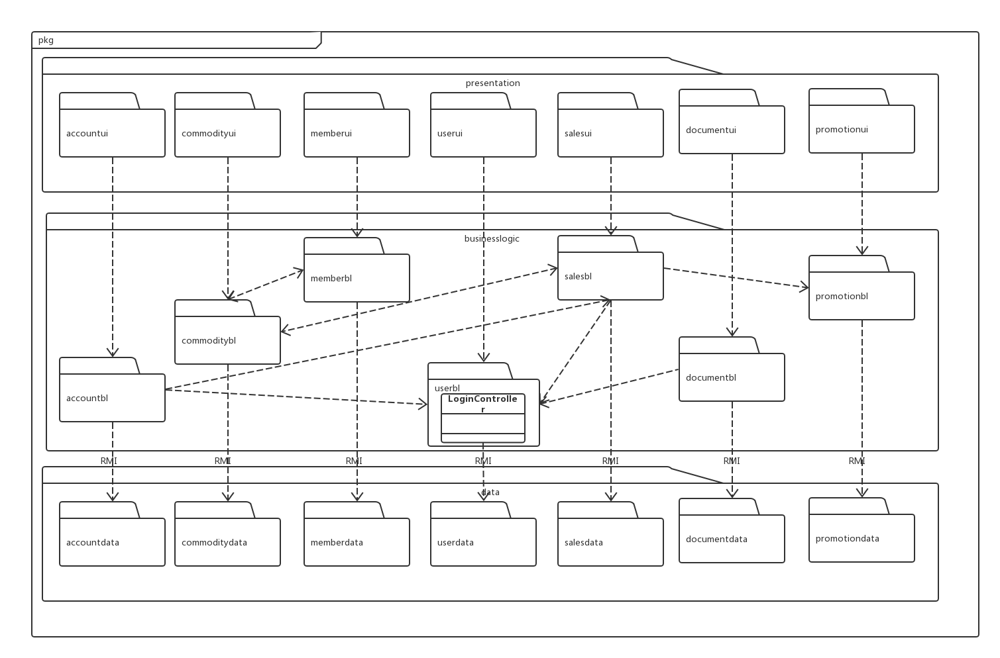

<table><tbody>
     <tr>
          <th>功能</th>
          <th>对应逻辑包</th>
      </tr>
      <tr>
          <td>销售</td>
          <td>salesui,salebl,salesdata</td>
      </tr>
      <tr>
          <td>库存</td>
          <td>commodityui,commoditybl,commoditydata</td>
      </tr>
       <tr>
          <td>客户</td>
          <td>memberui,memberbl,memberdata</td>
      </tr>
      <tr>
          <td>用户</td>
          <td>userui,userbl,userdata</td>
      </tr>
      <tr>
          <td>账户</td>
          <td>accountui,accountbl,accountdata</td>
      </tr>
      <tr>
          <td>单据</td>
          <td>documentui,documentbl,documentdata</td>
      </tr>
       <tr>
          <td>销售策略</td>
          <td>promotionui,promotionbl,promotiondata</td>
      </tr>

</table>

